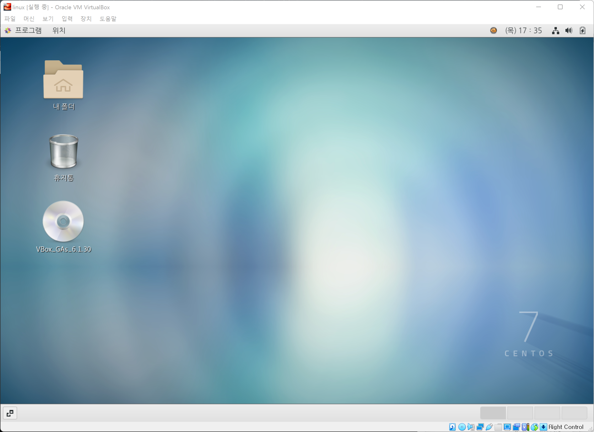

### 리눅스 _ 하둡 _ 스파크 _ 몽고DB_part1

#리눅스 #하둡 #스파크

1. 가상환경 구성
2. 쥬피터 노트북 연결_ GPU 연결
3. 리눅스 환경에서 깃허브에 연결
4. 리눅스 명령

- 포트폴리오
  - 노션(NOTION) / 파워포인트(PDF) >> 자기소개서 PDF 다운 받게 유도
  - 캐글 (개인/팀프로젝트) / 팀프로젝트
  - 팀프로젝트(멘토)
  - 깃허브 / 블로그 (1일1커밋) >> 잔디심는 사람, 예제에 주석 남겨 커밋하기

---

5. 하둡 이론 - 설치
6. HDFS 명령어
7. HIVE 설치, 명령어
8. 스파크 이론 - 설치
9. 스파크 명령어 
10. 몽고DB 설치 명령어
11. 몽고DB - 리액트(REACT)

---

1. 가상환경 구성

   1. 가상화란?

      - https://m.blog.naver.com/ilikebigmac/222009981745

   2. 오라클 버추얼 박스

      - https://www.virtualbox.org/wiki/Downloads
      - 윈도우 PC 안에 작은 PC (논리적으로 구분) 설치한다고 생각하자
      - 약간 이런식으로 생각해,,

   3. 가상환경에 리눅스 설치하기

      - Centos 리눅스 설치

      - http://mirror.anigil.com/CentOS/7.9.2009/isos/x86_64/

      - CentOS-7-x86_64-DVD-2009.iso 설치

        

      - Virtual Box 열기

        - 이름 및 운영체제

        - 이름 : linux, 머신폴더 : default, 종류 : linux, 버전 : Red Hat(64bit)

        - 메모리 크기 : 2048mb (변경)

        - Red Hat 32bit  로 나올때 BIOS 변경하는 법 : https://m.blog.naver.com/n_jihyeon/221099021710

        - 파일크기 :

          - 주피터, 깃허브만 쓴다면 : 10GB
          - 하둡, 스파크, 몽고DB까지 쓴다면 : 30GB

        - 하드 디스크 파일 종류 : VDI (Virtual Box 디스크 이미지)

        - 물리적 하드 드라이브 지정 : 동적 할당

          

      - 시작버튼 누르기!

        - 시동디스크 선택
   
        - 추가버튼 눌러기
   
        - 다운받아 놓은 'CentOS-7-x86_64-DVD-2009.iso' 선택
   
        - install centos 방향키로 엔터!
   
          
   
      - 갑자기 마우스 핸들링이 안될 때(움직이지 않을 때)
   
        1. right button >> host key 변경해야 함. 
   
           - 아래 방향 화살표 클릭 >> 키보드 설정 >> 호스트키 조합 : ctrl + alt
   
        2. 전원 끄고 설정 재설정하기
   
           - 설정 클릭 >> 시스템 >> 마더보드 >> 포인팅자치 : USB 태블릿 변경 >> 확인
   
           - 설치 요약 >> 설치 대상 >> 자동파티션 클릭 >> 완료
   
           - 소프트웨어 선택 (very important)
   
             - GNOME 데스크 탑 >> 선택한 환경 기능 (전부 선택) >> 완료
   
               
   
           - 사용자 설정
   
             - ROOT 암호 : 12345678
   
             - 사용자 생성 : jibook(원하는대로 입력), 암호 : 12345678
   
               
   
      - 설정 완류 후 재부팅 클릭
   
        - Lincesing 동의 클릭
   
        - 동의 >> 설정 완료
   
          
   
      - 로그인 화면
   
      - 게스트 확장 CD 삽입

[ 전체 순서 ]

1. root 로 접속한다.
2. 장치 >> 제일 아래에 위치한 게스트 확장 cd 삽입 클릭
3. 바로 실행하겠습니까? >> 실행
4. 바탕화면에 vbox cd 모양 나오면 클릭해서 연다.
5. 설치 관련 화면 팝업 뜨면, 프로그램 상단 옆에 프로그램 실행 클릭 >> 설치한다
6. 재부팅

- 전원버튼 (jibook 로그아웃)
- 목록이 없습니다? 클릭 >> root로 접속 / 입력 비번 : 12345678

​		ctrl + alt + delete 가상환경에서 빠져 나옴

- 장치에 게스트 확장 cd 삽입 누른다. 
- 가상화경 상 오른쪽 마우스 클릭 >> 터미널 열기
- reboot
- 제대로 되었나 확인 시 >> 보기 >> 가상화면 1 >> 크기조정 확인 
  - 가상화면 크기 1920*1080 (보통이케 함)

- [꿀팁] 윈도우와 복사 붙여넣기를 자유롭게 하기위해
  - 터미널 창 열기 #whoami 잘 나오는지 확인
  - 리눅스 창 상단에 위치한 장치 클릭 >> 클립보드 공유 >> 양방향 클릭
  - 메모장 열어서 whoami 치고 ctrl + shift + c, v (복붙)

- 가상환경 리눅스에 인터넷 되게 하는 방법
  - 설정 클릭 >> 네트워크 >> 유선(켬) 변경
  - 자동으로 연결 클릭 >> 적용 

---

### 요약

1. Virtual Box, CentOS 다운로드
2. 설정에 맞춰 Virtual Box 다운받은 후 시동 디스크 설정을 'CentOS-7-x86_64-DVD-2009.iso'에 지정 선택
3. 시작!
4. 언어 설정(마우스가 안될 시 벌쳐박스에서 마더보드 포인팅 장치 usb 장치) 
5. 설치 대상, 소프트웨어 선택(핵중요 : GNOME 데스크탑 : 모두 선택) 설정 후 설치 시작
6. 화면을 크게 하기 위해서 '장치 >> 게스트 확장 cd >> 바탕화면에 cd폴더 열고 프로그램 확장 눌러서 yes'
7. 재부팅
8. 그럼 쫌 앵간치 되는 것 같은데?

ㅎㅎ첫리눅스ㅎㅇ

